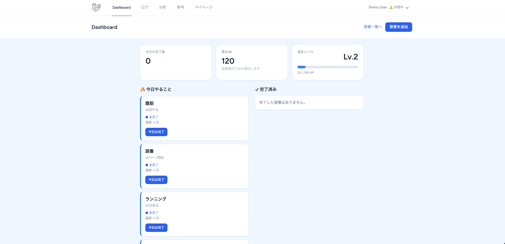
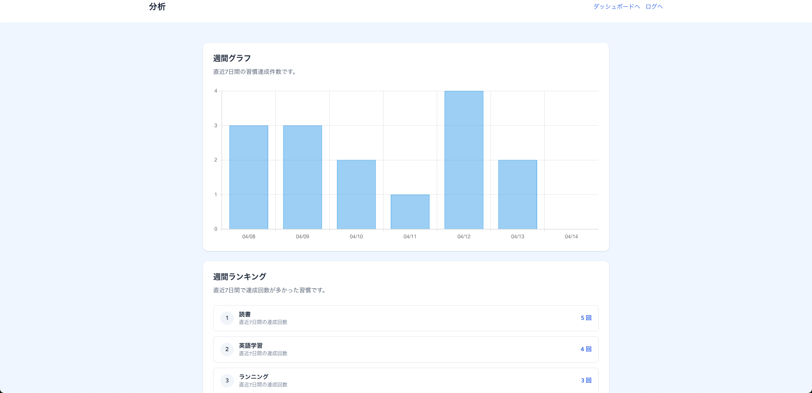
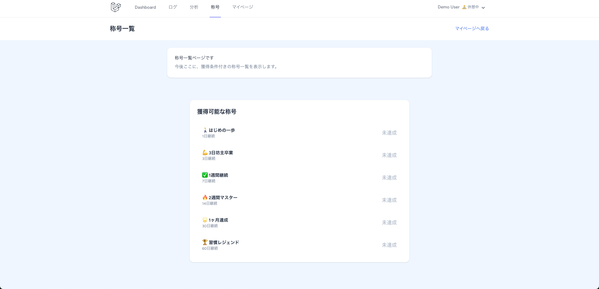
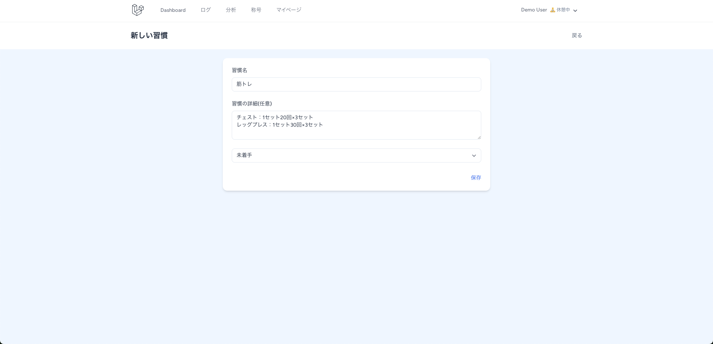

# Motireco

## アプリ概要
## 要件定義
## デモ（※後で追加）
## 主な機能
## 使用技術
## 工夫したポイント
## 画面一覧
## AI機能（構想・実装方針）
## 🌐 デモ
## 今後の改善予定

## アプリ概要
Motireco は、日々の習慣を記録・可視化し、継続をサポートする習慣管理アプリです。

日々の達成状況を記録することで、連続達成日数（ストリーク）や経験値（XP）を獲得し、
ゲーム感覚でモチベーションを維持しながら習慣化を促進します。

また、週次レポートや達成率の可視化により、自身の行動を振り返ることができます。

## 🎯 要件定義

### ■ 背景
日々の習慣を継続することが難しく、三日坊主になってしまう課題があると感じた。

### ■ 課題
- 習慣の達成状況が可視化されていない
- 継続のモチベーションが維持しづらい
- 記録が単調で続かない

### ■ 解決策
- 達成状況を可視化するダッシュボードを実装
- XPやレベルなどのゲーム要素を導入
- 非同期処理によりストレスのない操作体験を提供

### ■ ターゲットユーザー
- 習慣を継続したい人
- モチベーション維持が苦手な人
- 自己管理をしたい人

### ■ 期待される効果
- 習慣の継続率向上
- 行動の可視化による自己理解の促進

## 主な機能

### ■ 習慣管理
- 習慣の作成 / 編集 / 削除
- 習慣ごとの詳細（達成条件）の設定

### ■ ダッシュボード
- 今日の達成率 / 完了数の表示
- 未達 / 完了済みの習慣を一覧表示
- ワンクリックで達成記録（非同期）

### ■ ログ管理
- 日ごとの実施記録を確認

### ■ 分析機能
- 直近7日間の達成数表示
- 週間達成率の可視化
- 習慣ランキング表示

### ■ ゲーミフィケーション
- XP（経験値）システム
- レベルアップ機能
- 連続達成（ストリーク）
- 称号システム

### ■ マイページ
- 自身の達成状況・成長の可視化
  

## 使用技術

- PHP 8.x
- Laravel 12
- Blade
- Tailwind CSS
- SQLite
- Chart.js（グラフ表示）
- Vite

## 工夫したポイント

### ■ ゲーミフィケーションによる継続促進
習慣の継続を促すため、XP（経験値）・レベル・称号・連続達成（ストリーク）といった
ゲーム要素を取り入れ、ユーザーが楽しみながら習慣化できる設計にしました。

### ■ 非同期処理による快適な操作性
「今日完了」ボタンを押した際、ページリロードなしでUIが更新されるようにし、
ストレスのない操作体験を実現しました。

### ■ データの可視化による振り返り機能
直近7日間の達成数や週間達成率を可視化することで、
ユーザーが自身の行動を客観的に振り返れるように設計しました。

### ■ 習慣の定義を明確にする設計
習慣ごとに「詳細（達成条件）」を設定できるようにし、
曖昧な記録にならないように設計しました。

例：
・「英語」ではなく「英語を10分勉強する」
・「筋トレ」ではなく「腕立て10回」

これにより、達成・未達の判断基準を明確にしています。

### ■ UIの統一感と視認性
カードUIをベースにし、未達・完了を色で直感的に判断できるようにしました。
また、情報量が多くなりすぎないようにレイアウトを調整しました。

## 画面一覧

### ■ ダッシュボード
習慣の達成状況やXP、レベルを一覧で確認できます。

### ■ 分析ページ

### ■ 称号一覧

### ■ 習慣作成

## AI機能（構想・実装方針）

習慣ごとにアドバイスを返す機能を実装予定。

本来はLLM API連携を想定した設計だが、
開発環境ではコストを考慮し、ダミー応答で動作確認できる構成にしている。

## 🌐 デモ

以下のURLからアプリを実際にお試しいただけます。

🔗 https://motireco.onrender.com/login

### デモアカウント
- メールアドレス：demo@example.com
- パスワード：password

※ログイン後、ダッシュボードから習慣の達成/取り消しを体験できます。

### おすすめ操作
- 「今日は完了」ボタンを押すと、非同期でUIが更新されます
- 習慣を複数登録すると、ランキングや分析が表示されます

## 今後の改善予定

- 習慣ごとの達成条件の詳細化（回数・時間など）
- 通知機能（リマインド）
- 月次・年次の分析機能の追加
- UI/UXのさらなる改善
- 複数ユーザー対応